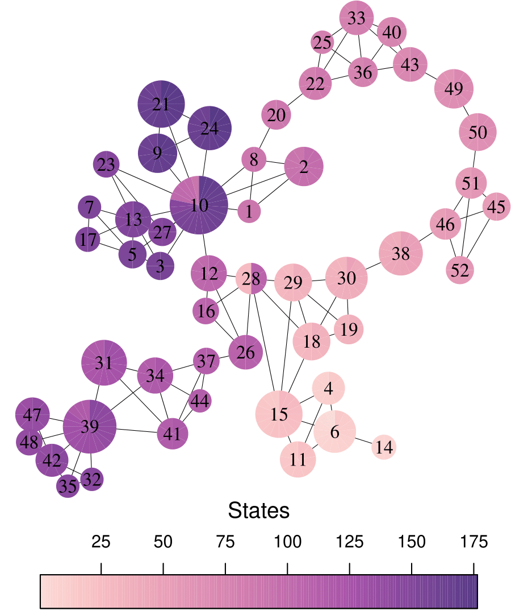

# TDA suspense
Analysis code for the master's thesis: Revealing brain network dynamics during the emotional state of suspense using topological data analysis

## Dataset

- Please note given the sharing-restrictions, the large size of some files and the limitation capacity in the repository do not allow us uploading the full data here. You can obtain the original data from the CamCan Consortium, request the extracted data from Prof <a href="https://github.com/rschmaelzle"> Schmaelzle</a> or Prof. <a href="https://github.com/claregrall"> Grall </a> or me and I can share extracted data too.
- The results from most of the computations are in the /Data folder (except the metioned data)
- Some files in the folder are taken from the [NITRC place of the Shen parcellation](https://www.nitrc.org/frs/?group_id=51), [the BioImage Suite Web](https://github.com/bioimagesuiteweb/bisweb) and the [Analysis for Schmälzle & Grall](https://github.com/nomcomm/CamCanSuspenseISC_JMP). Please give the corresponding credit.


## Code
The Jupyter notebooks to reproduce the analyses are in the /Code folder. 
There are some considerations:
- The file `requirements.txt` specifies the Python and R packages used in the project.
- Most functions used in the project are in the `files _functions-py.py` and `functions-R.R` . This plain scripts were automatically generated and linked by jupytext from their respectives Jupyter notebooks.
- The `Mapper` package in R can be installed via [devtools](https://github.com/r-lib/devtools) package: 

```R
require("devtools")
devtools::install_github("aaolaveh/Mapper")
```
This personal Mapper's version is a forked project from the original [Mapper R package ](https://github.com/peekxc/Mapper) of Matt Piekenbrock. 

In addtion, Mapper construction relies on [simplextree](https://github.com/peekxc/simplextree). The current version is not yet compatible with Mapper, thus, install or maintain if asked the older version
```R
devtools::install_github("peekxc/simplextree@6e34926")
```

Finally, som code was generated to make the Mapper graphs. If you find it helpful, consider putting the reference to this GitHub page.

<p align="center">
    
</p>


